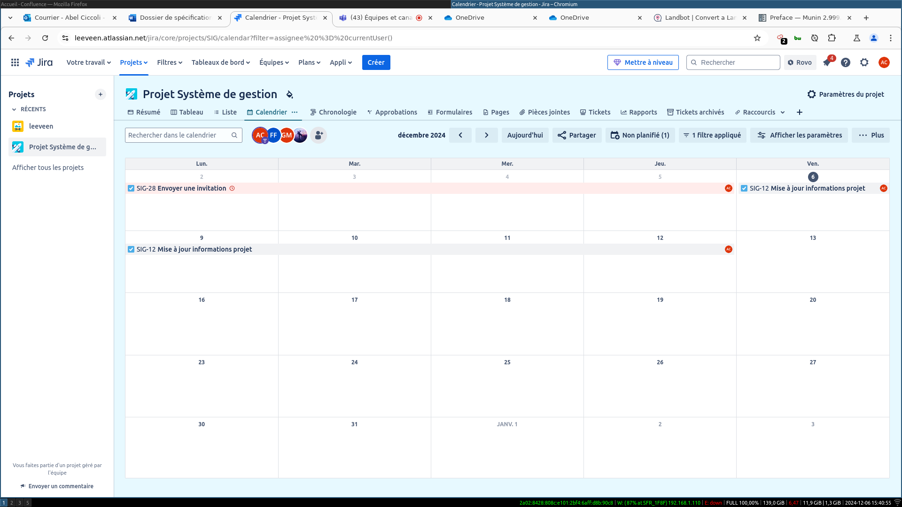

# Projet agile

Auteurs : Abel, Florian, Nicolas, Gildas

## Exploration de la création d'un diagramme de Gant

L'un des aspects les plus cruciaux pour l'allocation de ressource et la gestion du budget est la priorisation des tâches est le diagramme de Gant.

Celui-ci permet d'avoir une idée d'à quel point les tâches sont paralléslisables, et quelle est la masse critique de ressources mobilisables pour faire avancer 
le projet.

On peut ainsi poser les différentes tâches du projet sur le diagramme de Gant et faire des liens entre chacun d'entre eux.

