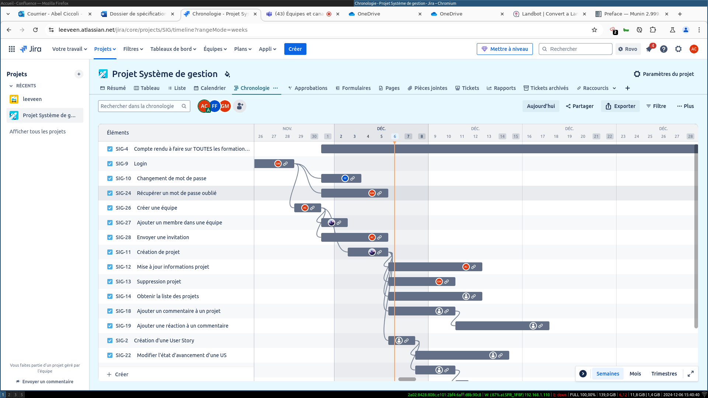

## Exploration de la création d'un diagramme de Gantt

L'un des aspects les plus cruciaux pour l'allocation de ressources et la gestion du budget est la priorisation des tâches est le diagramme de Gantt.

Celui-ci permet de cerner si les tâches sont parallélisables, dans quelle mesure elles le sont, et quelle est la masse critique de ressources mobilisables pour faire avancer le projet.

On peut ainsi poser les différentes tâches du projet sur le diagramme de Gantt et faire des liens entre chacune d'entre elles. On peut également depuis ce tableau assigner les tâches aux personnes.

Après avoir créé les users-stories correspondant à notre dossier de spécifications, nous avons donc décidé de mettre en place un diagramme de Gantt pour avoir une vue d'ensemble de notre planning. Nous avons ensuite assigné les tâches aux différentes personnes, en essayant au maximum de répartir les ressources.

Voilà donc à quoi ressemble une partie de ce diagramme de Gantt : 

Et voilà donc le planning dans l'onglet calendrier : 

